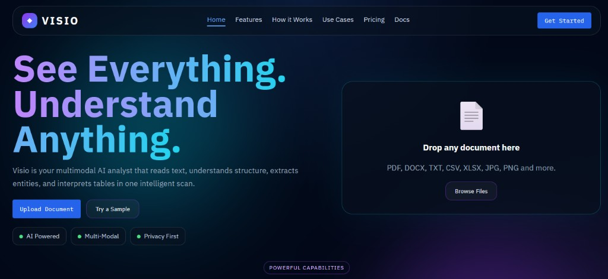
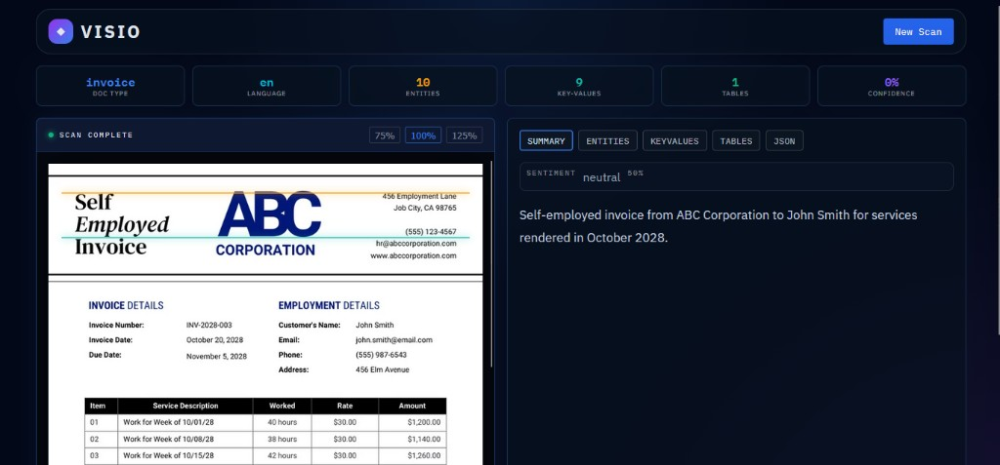
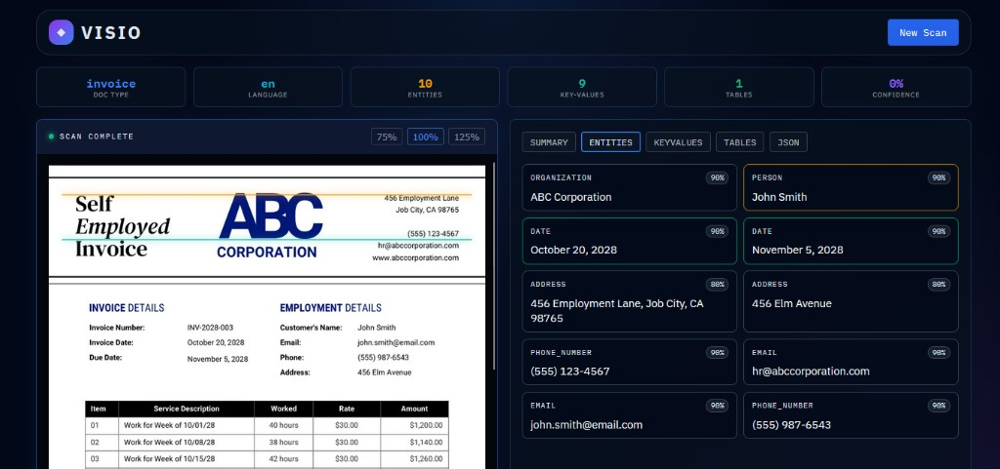
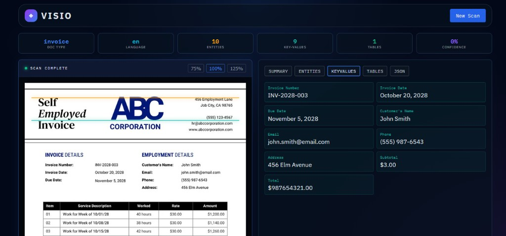
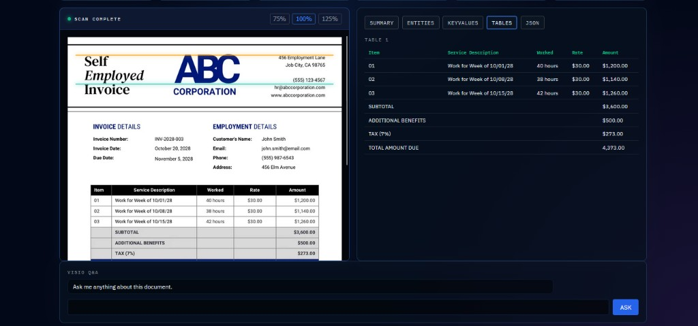

<div align="center">

# 👁️ VISIO

### Smart Invoice Analyzer — Multimodal Document Intelligence With Live Scanner UI

[](https://www.python.org/)
[](https://fastapi.tiangolo.com/)
[](https://docs.pydantic.dev/)
[](https://react.dev/)
[](https://groq.com/)
[](https://github.com/crastatelvin/visio-smart_invoice_analyzer/actions)
[](LICENSE)

<br/>

> **VISIO** is a production-style multimodal invoice analysis platform. Upload a document image/PDF, run one intelligent scan, and get structured extraction for document type, key-values, entities, tables, summary, and confidence — all rendered in a premium neon scanner dashboard with real-time progress and built-in Q&A.

<br/>

   

</div>

---

## 📋 Table of Contents

- [Overview](#-overview)
- [Application Preview](#-application-preview)
- [Features](#-features)
- [Architecture](#-architecture)
- [Tech Stack](#-tech-stack)
- [Project Structure](#-project-structure)
- [Installation](#-installation)
- [Usage](#-usage)
- [API Reference](#-api-reference)
- [Configuration](#-configuration)
- [Testing \& CI](#-testing--ci)
- [Security Notes](#-security-notes)
- [Design Decisions](#-design-decisions)
- [License](#-license)

---

## 🧠 Overview

VISIO focuses on a real business workflow: invoice intelligence from mixed-format uploads. The backend normalizes files (PDF/image/text), runs multimodal analysis through Groq, validates and enriches extraction output, and serves it to a scanner-style React dashboard.

Users can:

- Upload invoices via drag/select and watch live scan stages
- Extract structured output (`entities`, `key_values`, `tables`, `summary`, confidence)
- Ask natural-language questions about the scanned document
- Copy full JSON output for downstream automation
- Run with optional API-key auth, request IDs, and SQLite persistence

---

## 🖼️ Application Preview

<div align="center">

### 1) Landing Page



<br/>

### 2) Dashboard



<br/>

### 3) Entities



<br/>

### 4) Keyvalues



<br/>

### 5) Tables with Chat bot for more insights



</div>

---

## ✨ Features

| Feature | Description |
|---|---|
| 🧾 **Multimodal Invoice Parsing** | Reads PDF/image/text inputs and extracts business-ready structured data |
| 📊 **Layered Extraction UI** | Tabs for summary, entities, key-values, tables, and raw JSON |
| 🔴 **Live Scan Progress** | WebSocket-driven progress stream (`uploading`, `rendering_pages`, `scanning`, `complete`) |
| 🧠 **Q\&A Over Document** | Ask questions after scan; answers are grounded in extracted text + image |
| 🛠️ **Extraction Hardening** | Suspicious-output detection, verification pass, and amount-field repair for noisy outputs |
| 🔐 **Optional API Key Protection** | Enable `VISIO_API_KEY` to protect scan/ask endpoints |
| ⏱️ **Rate Limiting** | Per-IP limiter for scan and ask calls |
| 💾 **SQLite Persistence** | Stores scan payloads and limiter state using `VISIO_DB_PATH` |
| 📈 **Observability Baseline** | Request IDs + structured request logs + `/metrics` counters |
| 🎨 **Premium Neon UI Theme** | Consistent glassmorphism style across landing and dashboard |

---

## 🏗️ Architecture

```
┌───────────────────────────────────────────────────────────────────┐
│                        React Scanner UI                           │
│                                                                   │
│  UploadPage ──► ScannerPage ──► Tabs (Summary/Entities/KV/Tables) │
│      │              │                    │                        │
│      └────── POST /scan + WS /ws ◄──────┘                         │
│                         POST /ask                                 │
└──────────────────────────────┬────────────────────────────────────┘
                               │
                               ▼
┌───────────────────────────────────────────────────────────────────┐
│                          FastAPI Backend                          │
│                                                                   │
│  Middleware: CORS + request-id logging + optional API-key auth    │
│                                                                   │
│  /scan  ─► document_processor.py  ─► vision_analyzer.py           │
│                                  └► groq_service.py               │
│                                  └► entity_extractor.py           │
│                                  └► structured_extractor.py       │
│                                                                   │
│  /ask   ─► groq_service.py                                        │
│  /ws    ─► job-scoped progress stream                             │
│                                                                   │
│  storage.py (SQLite) stores latest scan and rate-limit windows    │
└───────────────────────────────────────────────────────────────────┘
```

---

## 🛠️ Tech Stack

| Layer | Technology |
|---|---|
| **Backend** | FastAPI, Pydantic 2, Uvicorn, Python 3.11+ |
| **Provider** | Groq Chat Completions API |
| **Document Processing** | PyMuPDF, Pillow |
| **Persistence** | SQLite (`sqlite3`) |
| **Frontend** | React 18, Framer Motion, custom CSS (IBM Plex) |
| **Transport** | REST + WebSocket |
| **Testing** | Pytest (backend), CRA test/build checks (frontend) |
| **CI** | GitHub Actions (`.github/workflows/ci.yml`) |

---

## 📁 Project Structure

```
visio-smart_invoice_analyzer/
│
├── backend/
│   ├── main.py                    # FastAPI routes + middleware + ws
│   ├── config.py                  # Env-driven settings
│   ├── schemas.py                 # Typed response/request models
│   ├── storage.py                 # SQLite-backed persistence + rate limit
│   ├── document_processor.py      # PDF/image/text normalization
│   ├── vision_analyzer.py         # Analysis orchestration
│   ├── groq_service.py            # Groq integration + parser + hardening
│   ├── entity_extractor.py        # Entity normalization helpers
│   ├── structured_extractor.py    # Table/KV extraction helpers
│   ├── tests/
│   │   ├── test_api.py
│   │   └── test_parser.py
│   ├── requirements.txt
│   └── .env.example
│
├── frontend/
│   ├── src/
│   │   ├── App.jsx
│   │   ├── pages/
│   │   │   ├── UploadPage.jsx
│   │   │   └── ScannerPage.jsx
│   │   ├── components/            # Scanner UI + data panels + chat
│   │   ├── hooks/useWebSocket.js
│   │   ├── services/api.js
│   │   └── styles/globals.css
│   ├── public/
│   └── package.json
│
├── sample_docs/
│   ├── sample_invoice.txt
│   └── README_samples.md
│
├── .github/workflows/ci.yml
├── DECISIONS.md
├── LICENSE
└── README.md
```

---

## 🚀 Installation

### 1) Clone

```bash
git clone https://github.com/crastatelvin/visio-smart_invoice_analyzer.git
cd visio-smart_invoice_analyzer
```

### 2) Backend

```bash
cd backend
python -m venv venv
venv\Scripts\activate
pip install -r requirements.txt
copy .env.example .env
python -m uvicorn main:app --reload --port 8000
```

### 3) Frontend

In a second terminal:

```bash
cd frontend
npm install
copy .env.example .env
npm start
```

Frontend: `http://localhost:3000`  
Backend docs: `http://localhost:8000/docs`

---

## 💻 Usage

1. Open the landing page and upload an invoice
2. Watch scan progress in real time
3. Review extracted tabs:
   - `SUMMARY`
   - `ENTITIES`
   - `KEYVALUES`
   - `TABLES`
   - `JSON`
4. Ask follow-up questions in the built-in VISIO Q&A panel

Quick API smoke test:

```bash
curl -X GET http://localhost:8000/status
```

---

## 📡 API Reference

| Method | Endpoint | Description |
|---|---|---|
| `GET` | `/` | Service status |
| `POST` | `/scan?job_id=<uuid>&pdf_mode=first_page|all_pages&pdf_page_limit=3` | Upload + analyze document |
| `POST` | `/ask?job_id=<uuid>` | Ask about previously scanned document |
| `GET` | `/latest?job_id=<uuid>` | Fetch latest result for a job |
| `GET` | `/status` | Health and runtime info |
| `GET` | `/metrics` | Basic request/usage counters |
| `WS` | `/ws?job_id=<uuid>` | Job-scoped progress events |

---

## ⚙️ Configuration

`backend/.env`:

```bash
GROQ_API_KEY=...
VISIO_MODEL=meta-llama/llama-4-scout-17b-16e-instruct
VISIO_ALLOWED_ORIGINS=http://localhost:3000
VISIO_MAX_FILE_SIZE_MB=10
VISIO_MAX_IMAGE_DIMENSION=1600
VISIO_REQUEST_TIMEOUT_SECONDS=120
VISIO_DB_PATH=visio.db
VISIO_API_KEY=
```

`frontend/.env`:

```bash
REACT_APP_API_URL=http://127.0.0.1:8000
REACT_APP_WS_URL=ws://127.0.0.1:8000/ws
```

---

## 🧪 Testing & CI

Backend:

```bash
cd backend
python -m pytest -q
```

Frontend:

```bash
cd frontend
npm test -- --watchAll=false
npm run build
```

GitHub Actions runs backend tests + frontend test/build on push and PR.

---

## 🔒 Security Notes

- Optional API key middleware protects scan/ask when `VISIO_API_KEY` is set
- CORS is env-configurable and should be locked to your frontend origin in production
- Upload size is capped and input types are validated
- Rate limiting is enforced per IP and stored in SQLite for single-node persistence

---

## 🧭 Design Decisions

See [`DECISIONS.md`](./DECISIONS.md) for architecture rationale, including:

- job-scoped websocket progress model
- canonical backend preview image strategy
- JSON-first model parsing with fallback behavior
- why current persistence is SQLite-first

---

## License

This project is licensed under the MIT License. See [LICENSE](./LICENSE).

                            ### Built by [Telvin Crasta](https://github.com/crastatelvin) · Production-ready · Live today

                                      ⭐ **If VISIO helped you ship invoice intelligence faster, star the repo.**
